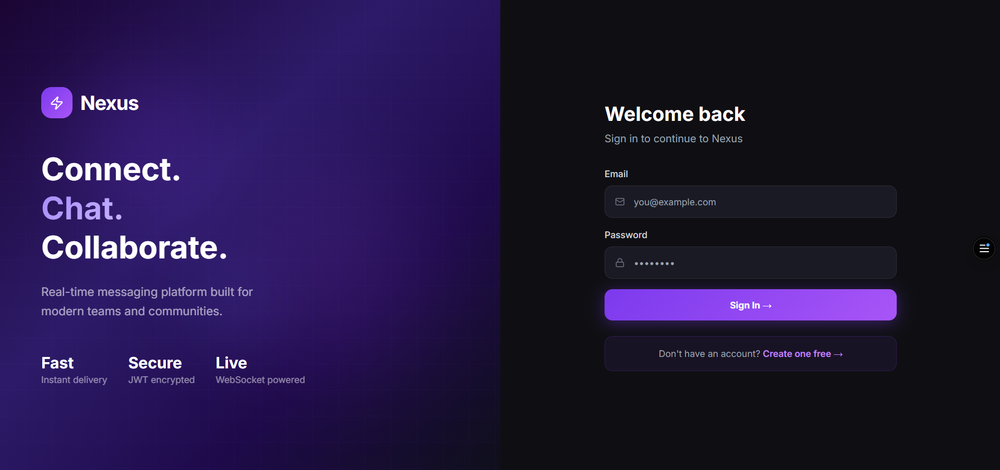

# Nexus — Real-time Chat Platform


> A modern real-time chat platform powered by FastAPI, React, and WebSockets.

🌐 **Live Demo:** https://nexus-seven-peach-22.vercel.app

---

## ✨ Features

- 🔐 User registration and login (JWT authentication)
- 💬 Real-time messaging with WebSockets
- 👥 Group chat with multiple members
- 📌 Pin important messages
- ↩️ Reply to messages
- 😊 Emoji picker support
- 🖼️ Image sharing in chat
- 🤖 AI message suggestions (Groq LLaMA)
- 🗑️ Delete messages
- 🔔 Browser notifications with sound
- 🟢 Real-time online/offline status
- ✏️ Typing indicator
- 🔍 Search users and messages
- 🌙 Dark and Light theme toggle
- 📱 Mobile responsive UI
- 🎨 Colorful unique avatars

---

## 🛠️ Tech Stack

| Layer | Technology |
|-------|-----------|
| Frontend | React 18, Vite, TailwindCSS, Zustand |
| Backend | Python, FastAPI, WebSockets |
| Database | PostgreSQL (Supabase) |
| Auth | JWT Tokens |
| AI | Groq API (LLaMA 3) |
| Deploy Frontend | Vercel |
| Deploy Backend | Render |

---

## 🚀 How to Run Locally

### Prerequisites
- Python 3.11+
- Node.js 18+
- Supabase account

### Backend

```bash
cd backend
pip install -r requirements.txt
```

Create `backend/.env`:
```env
DATABASE_URL=postgresql+asyncpg://...
SECRET_KEY=your-secret-key
ALGORITHM=HS256
ACCESS_TOKEN_EXPIRE_MINUTES=10080
GROQ_API_KEY=your-groq-key
```

```bash
uvicorn app.main:app --reload --port 8000
```

### Frontend

```bash
cd frontend
npm install
```

Create `frontend/.env`:
```env
VITE_API_URL=http://localhost:8000
```

```bash
npm run dev
```

Open http://localhost:5173

---

## 🔗 Links

- 🌐 Live Website: https://nexus-seven-peach-22.vercel.app
- 🔧 API Docs: https://nexus-chat-api-2n8m.onrender.com/docs
- 📦 GitHub: https://github.com/aktanium/Nexus
- 🎥 Demo Video: [YouTube Link — add after recording]

---

## 📸 Screenshots



---

## 👨‍💻 Author

Built with ❤️ using AI-assisted development tools.

---
